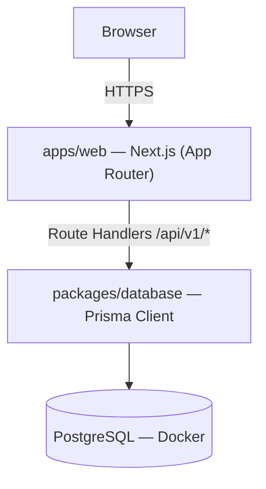
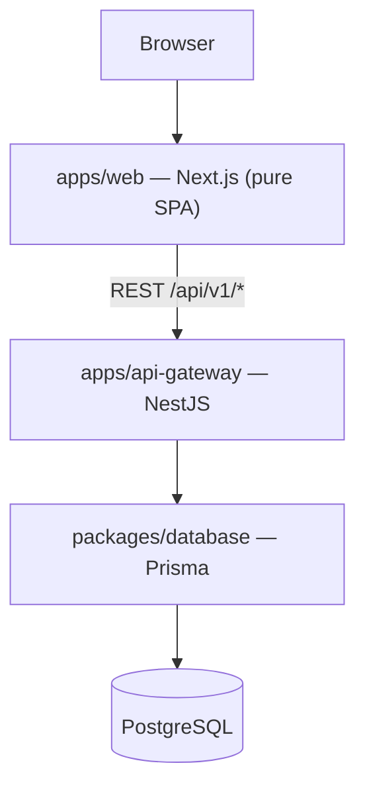
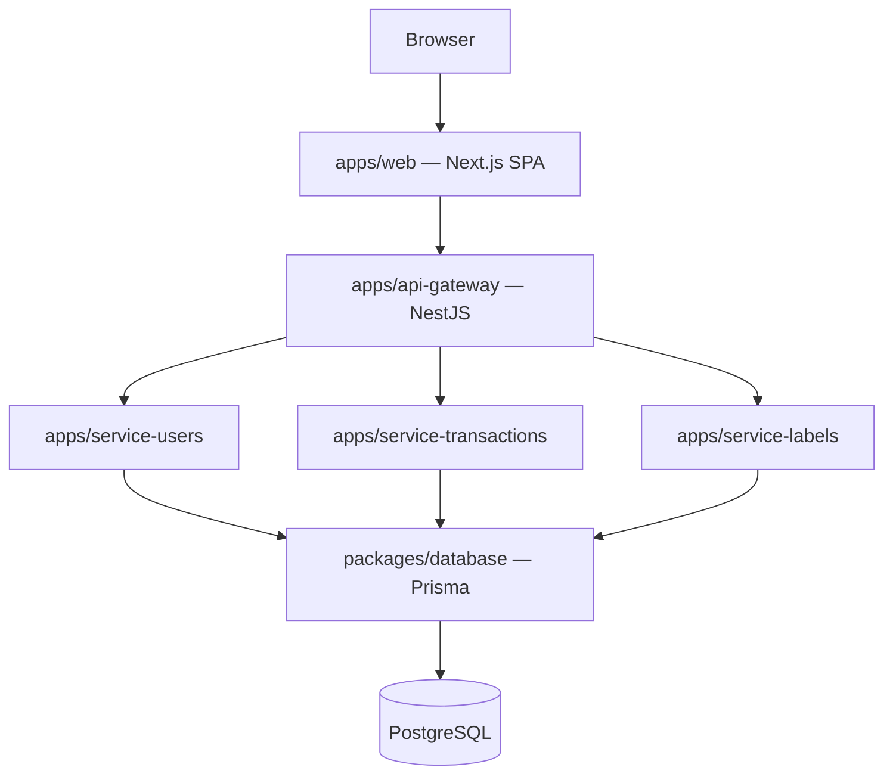
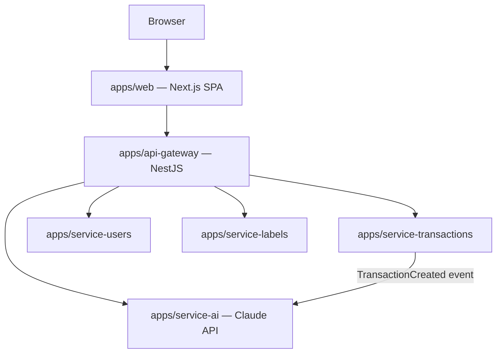
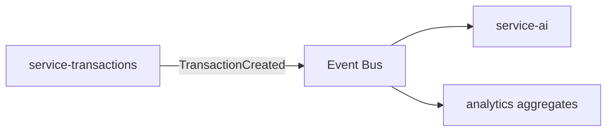
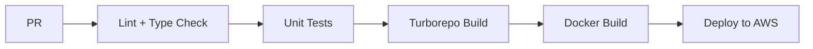

# BDGT Architecture

## Table of Contents

1. [Overview](#overview)
2. [Technology Stack](#technology-stack)
3. [Architectural Principles](#architectural-principles)
4. [Evolution Strategy](#evolution-strategy)
   - [Phase 1 — MVP: Fullstack Next.js](#phase-1--mvp-fullstack-nextjs)
   - [Phase 2 — API Gateway Extraction](#phase-2--api-gateway-extraction)
   - [Phase 3 — Domain Microservices](#phase-3--domain-microservices)
   - [Phase 4 — AI & Analytics Services](#phase-4--ai--analytics-services)
5. [Monorepo Structure](#monorepo-structure)
6. [Next.js Frontend Architecture](#nextjs-frontend-architecture)
7. [NestJS Service Internal Structure](#nestjs-service-internal-structure)
8. [Shared Packages](#shared-packages)
9. [Database Strategy](#database-strategy)
10. [API Design](#api-design)
11. [Inter-Service Communication](#inter-service-communication)
12. [Security](#security)
13. [Observability](#observability)
14. [Infrastructure & Docker](#infrastructure--docker)
15. [CI/CD Pipeline](#cicd-pipeline)
16. [Testing Strategy](#testing-strategy)
17. [Architecture Decision Records](#architecture-decision-records)

---

## Overview

BDGT is a TypeScript monorepo (pnpm + Turborepo) personal finance platform. The architecture is designed to **evolve in explicit phases** — from a lean MVP shipped as a fullstack Next.js application to a production-grade distributed system with independent NestJS microservices per domain.

The central architectural bet: **Next.js Route Handlers are sufficient to serve as a BFF (Backend for Frontend) and API gateway in the MVP.** This avoids the overhead of a second process, a second deployment, and a second service to maintain before the product is validated. The extraction path to NestJS microservices is explicit, low-risk, and designed into the monorepo structure from day one.

Key outcomes:
- End-to-end TypeScript type safety via a shared `contracts` package
- Domain-Driven Design applied consistently across all phases
- Feature-oriented frontend with co-located domain code
- Clean Architecture inside every NestJS service (post-MVP)
- AI extensibility as a first-class architectural concern
- Cloud-native, container-first deployment

---

## Technology Stack

| Layer | Technology | Why |
|---|---|---|
| Language | TypeScript | End-to-end type safety across all apps and packages |
| Runtime | Node.js | Single language across frontend and all backend services |
| Package Manager | pnpm | Fast installs, strict hoisting, workspace support |
| Monorepo | Turborepo | Incremental builds, remote caching, task orchestration |
| Frontend | Next.js (App Router) | SSR + Route Handlers = single deployable in MVP; pure SPA client post-MVP |
| API Gateway (post-MVP) | NestJS | Mature DI container, Guards, pipes — production-grade HTTP |
| Domain Services (post-MVP) | NestJS | Consistent clean architecture structure across all microservices |
| Database | PostgreSQL | Relational model suits finance data; ACID transactions |
| ORM | Prisma | Type-safe queries, schema-as-code, migration tooling |
| Validation | Zod | Runtime type safety; schemas serve as both validation and type source |
| Authentication | JWT + Refresh Token Rotation | Stateless; suitable for SPA + API architecture |
| Logging | Pino | Structured JSON; lowest overhead Node.js logger |
| Visualization | D3.js | Low-level control for custom budget and spending charts |
| AI | Claude API | Generative analytics, spending insights, budget recommendations |
| Containerization | Docker | Consistent local dev environment; parity with production |
| CI/CD | GitHub Actions | Tight GitHub integration; no extra tooling required |
| Cloud | AWS EC2 → ECS | Simple and understandable for MVP; upgradeable to ECS Fargate |
| Testing | Vitest, Supertest, React Testing Library, Playwright | Full pyramid: unit, integration, component, E2E |

---

## Architectural Principles

### 1. Evolutionary Architecture

Do not design for the final scale on day one. Design the **extraction boundaries** on day one, then move incrementally. Each phase introduces the minimum complexity needed for the current scale. The monorepo is structured for Phase 3 from the start — even though most `apps/service-*` directories are empty in the MVP. This communicates intent, reserves the namespace, and makes the first extraction a *move* rather than a design decision.

### 2. Next.js as BFF (Backend for Frontend)

In the MVP, Next.js App Router Route Handlers act as the API gateway. They handle authentication, validate inputs with Zod, and query the database through Prisma. This is not a shortcut — it is an intentional **BFF pattern** well-suited to a single-team, single-client product. The frontend and the API logic are co-deployed, reducing operational complexity at the cost of colocation that is easy to unwind later.

### 3. Contracts as the Service Boundary

`packages/contracts` contains all shared types, DTOs, and Zod schemas. This package is the **source of truth for all API shapes**. When a domain service is extracted in Phase 2 or 3, both the frontend and the gateway continue importing from `contracts` — the only thing that changes is which process executes the logic. Contracts make extraction a refactor, not a rewrite.

### 4. Clean Architecture inside every NestJS Service

When NestJS services appear post-MVP, each follows the same four-layer structure: **Presentation → Application → Domain → Infrastructure**. Business logic never touches Prisma directly; it goes through repository interfaces defined in the domain layer. NestJS dependency injection wires the implementation at runtime. This makes domain logic independently testable and service extraction low-risk.

### 5. Shared Nothing Except Packages

Each microservice is independently deployable and independently scalable. Services share `packages/` but not runtime state. A service may be restarted, redeployed, or replaced without affecting others.

---

## Evolution Strategy

### Phase 1 — MVP: Fullstack Next.js

**`apps/web` owns both the React frontend and the `/api/v1/*` API Route Handlers.**

- All business logic (auth, transactions, labels, users) runs as Next.js Route Handlers
- `packages/database` provides the Prisma client; Route Handlers call it directly
- PostgreSQL runs in Docker Compose locally; deployed to a single AWS EC2 instance
- No NestJS in the codebase — zero operational overhead before the product is validated

**Trigger to advance to Phase 2:** the team grows, frontend and backend need independent deploy cycles, or the API needs to serve non-browser clients (mobile, third-party).



---

### Phase 2 — API Gateway Extraction

**Extract the Next.js Route Handlers to `apps/api-gateway` (NestJS).**

- `apps/web` becomes a pure client — it calls `api-gateway` over HTTP instead of its own Route Handlers
- `apps/api-gateway` is a single NestJS application that still owns all domain logic (auth, transactions, labels, users) — it is a gateway in name but a monolith in implementation at this stage
- Zero type changes: `packages/contracts` is unchanged; the frontend import paths do not change
- Independent deployment of frontend and backend is now possible

**Trigger to advance to Phase 3:** individual domains need independent scaling, separate database isolation, or separate team ownership.



---

### Phase 3 — Domain Microservices

**Extract each business domain into its own NestJS app.**

- `apps/api-gateway` delegates requests to the appropriate domain service
- `apps/service-users`, `apps/service-transactions`, `apps/service-labels` each own their domain's business logic
- Each service applies Clean Architecture internally (see [NestJS Service Internal Structure](#nestjs-service-internal-structure))
- Inter-service communication starts as synchronous HTTP; async events are added when a specific use case requires decoupling (see [Inter-Service Communication](#inter-service-communication))
- `packages/database` is shared by all services initially; the path to database-per-service is open (see [Database Strategy](#database-strategy))



---

### Phase 4 — AI & Analytics Services

**Add `apps/service-ai` and analytics capabilities — purely additive.**

- `apps/service-ai` wraps the Claude API; it receives spending context and returns insights, forecasts, categorization suggestions, and budget recommendations
- Analytics aggregations (week/month/YTD/custom range) are served from the API gateway or a dedicated analytics service
- D3.js on the frontend renders the charts; the data contract is defined in `packages/contracts`
- No changes required to existing services



---

## Monorepo Structure

The structure is designed for Phase 3/4 from day one. Post-MVP `apps/service-*` directories are empty in the MVP but intentionally declared.

```
apps/
  web/                              # Next.js — frontend + MVP API gateway (Route Handlers)
  api-gateway/                      # NestJS API Gateway (post-MVP)
  service-users/                    # NestJS Users domain service (post-MVP)
  service-transactions/             # NestJS Transactions domain service (post-MVP)
  service-labels/                   # NestJS Labels/Categories service (post-MVP)
  service-ai/                       # NestJS AI Assistant service (post-MVP)
packages/
  contracts/                        # Shared DTOs, Zod schemas, enums — API contract source of truth
  database/                         # Prisma schema, client, migrations, seed scripts
  ui/                               # Shared React component library
  auth/                             # JWT utilities, NestJS guards, decorators, token payload types
  config/                           # Zod-validated env config with strong types per service
  logger/                           # Pino-based structured logger factory
  utils/                            # Shared pure utility functions (dates, money formatting)
  eslint-config/
  tsconfig/
infra/
  docker/
  compose/
  terraform/                        # AWS infrastructure as code
.github/
  workflows/
turbo.json
pnpm-workspace.yaml
package.json
```

> **Critical constraint:** `packages/contracts` must never import from `packages/database`. Contract types must remain usable in the browser and in services that have no database connection. Contracts contain only plain TypeScript types and Zod schemas — no Prisma models.

---

## Next.js Frontend Architecture

Feature-based co-location: the `app/` directory handles routing only; all business logic lives in `features/` (domain-specific) or `shared/` (reusable across features).

**Rule:** A page file imports from `features/` and `shared/` and composes them — nothing more. No business logic, no direct Prisma calls in page files.

```
apps/web/src/
  app/                              # App Router — routing layer only
    (auth)/                         # Route group: unauthenticated pages
      login/
        page.tsx
      register/
        page.tsx
      layout.tsx
    (private)/                          # Route group: authenticated shell
      layout.tsx                    # Sidebar, nav, session guard
      dashboard/
        page.tsx
      transactions/
        page.tsx                    # List view
        [id]/
          page.tsx                  # Detail / edit view
      labels/
        page.tsx
      settings/
        page.tsx
      analytics/                    # Post-MVP
        page.tsx
    api/                            # MVP API Gateway (Next.js Route Handlers)
      v1/
        auth/
          login/
            route.ts
          register/
            route.ts
          refresh/
            route.ts
          logout/
            route.ts
        transactions/
          route.ts                  # GET (list), POST (create)
          [id]/
            route.ts                # GET, PUT, DELETE
        labels/
          route.ts
          [id]/
            route.ts
        users/
          me/
            route.ts                # GET, PATCH
    layout.tsx                      # Root layout (fonts, providers)
    globals.css
  features/                         # Feature modules — domain logic lives here
    auth/
      components/                   # LoginForm, RegisterForm
      hooks/                        # useAuth, useCurrentUser, useLogout
      lib/                          # Token storage, auth helpers
      types.ts
    transactions/
      components/                   # TransactionList, TransactionCard, TransactionForm, TransactionFilters
      hooks/                        # useTransactions, useCreateTransaction, useDeleteTransaction
      api/                          # Fetch wrappers calling /api/v1/transactions
      lib/                          # Amount formatters, date formatters, validators
      types.ts
    labels/
      components/                   # LabelList, LabelBadge, LabelForm
      hooks/                        # useLabels, useCreateLabel
      api/
      lib/
      types.ts
    dashboard/
      components/                   # SummaryCard, SpendingChart, RecentTransactions
      hooks/                        # useDashboardStats
      lib/
    analytics/                      # Post-MVP
      components/                   # D3.js chart wrappers (WeeklyChart, MonthlyChart, YTDChart)
      hooks/                        # useAnalytics, useSpendingForecast
      lib/                          # D3 helpers, data transformations
  shared/
    components/
      ui/                           # Generic primitives: Button, Input, Modal, Card, Badge, Table, Spinner, Select
      layout/                       # PageHeader, Sidebar, NavBar, PageContainer
    hooks/                          # useDebounce, usePagination, useLocalStorage
    lib/
      api-client.ts                 # Base fetch wrapper with error handling and type inference
      validators.ts                 # Reusable Zod schemas (pagination, id params)
      utils.ts
    types/
      api.ts                        # Response envelope types (ApiResponse<T>, ApiError, PaginationMeta)
      common.ts
```

---

## NestJS Service Internal Structure

Every `apps/service-*` and `apps/api-gateway` follows the same Clean Architecture layout. The example below uses `service-transactions`.

**Dependency rule:** domain knows nothing about infrastructure. The repository interface is defined in `domain/repositories/`; the Prisma implementation lives in `infrastructure/prisma/`. NestJS DI wires them at module initialization.

```
apps/service-transactions/src/
  transactions/
    transactions.module.ts
    presentation/
      controllers/
        transactions.controller.ts
      dto/
        create-transaction.dto.ts
        update-transaction.dto.ts
        transaction-response.dto.ts
    application/
      commands/
        create-transaction.command.ts
        create-transaction.handler.ts
        delete-transaction.command.ts
        delete-transaction.handler.ts
      queries/
        get-transactions.query.ts
        get-transactions.handler.ts
        get-transaction-by-id.query.ts
        get-transaction-by-id.handler.ts
    domain/
      entities/
        transaction.entity.ts
      value-objects/
        money.value-object.ts
      events/
        transaction-created.event.ts
        transaction-deleted.event.ts
      repositories/
        transaction.repository.ts       # interface — no Prisma import here
    infrastructure/
      prisma/
        transaction-prisma.repository.ts  # implements transaction.repository.ts
      mappers/
        transaction.mapper.ts            # Entity <-> Prisma model conversion
  main.ts
  app.module.ts
```

The same pattern is applied to `service-users`, `service-labels`, and `service-ai`.

---

## Shared Packages

| Package | Purpose | Used By |
|---|---|---|
| `packages/contracts` | Request/response DTOs, Zod schemas, enums, event payload types | all apps |
| `packages/database` | Prisma client singleton, schema, migrations, seed scripts | web (MVP), all services (post-MVP) |
| `packages/ui` | Shared React component library (primitives and composed components) | `apps/web` only |
| `packages/auth` | JWT sign/verify helpers, NestJS guards, decorators, shared token payload types | web, api-gateway, all services |
| `packages/config` | Zod-validated env config factory — each app gets a typed config object | all apps |
| `packages/logger` | Pino logger factory — each app gets a named logger with service name as a default field | all apps |
| `packages/utils` | Pure utility functions: date formatting, money formatting, pagination helpers | all apps and packages |
| `packages/eslint-config` | Shared ESLint rules | all apps and packages |
| `packages/tsconfig` | Shared TypeScript base configs (base, nextjs, nestjs, library) | all apps and packages |

> `packages/contracts` must never import `packages/database`. This is enforced via ESLint import rules.

---

## Database Strategy

### MVP: Single Shared Database

`packages/database` provides a single Prisma client that all applications import. The schema is split into per-domain model files for maintainability:

```
packages/database/
  prisma/
    schema.prisma               # Root: generator, datasource, model imports
    models/
      user.prisma
      transaction.prisma
      label.prisma
  src/
    client.ts                   # Prisma client singleton (connect / disconnect)
    index.ts                    # Re-exports
  migrations/
  seed.ts
```

### Post-MVP: Path to Database-Per-Service

The `packages/database` client factory accepts a connection URL, making it straightforward to point each service at its own database in Phase 3. The migration tooling under `packages/database/migrations/` can be split per service when domain isolation requires it.

Prisma Migrate handles all schema changes. Running `prisma migrate dev` against the shared schema applies all pending migrations.

---

## API Design

### MVP Endpoint Inventory (Next.js Route Handlers)

```
POST   /api/v1/auth/register
POST   /api/v1/auth/login
POST   /api/v1/auth/refresh
DELETE /api/v1/auth/logout

GET    /api/v1/users/me
PATCH  /api/v1/users/me

GET    /api/v1/transactions
POST   /api/v1/transactions
GET    /api/v1/transactions/:id
PUT    /api/v1/transactions/:id
DELETE /api/v1/transactions/:id

GET    /api/v1/labels
POST   /api/v1/labels
GET    /api/v1/labels/:id
PUT    /api/v1/labels/:id
DELETE /api/v1/labels/:id
```

### Response Envelope Convention

Defined in `packages/contracts` and used by all apps across all phases:

```typescript
// Success response
type ApiResponse<T> = { data: T; meta?: PaginationMeta }

// Error response
type ApiError = { error: { code: string; message: string; details?: unknown } }

// Paginated meta
type PaginationMeta = { page: number; limit: number; total: number; totalPages: number }
```

### Versioning Rationale

`/api/v1/` is in the URL from day one. When the API gateway is extracted in Phase 2, **the URL shape does not change** — only the process serving it changes. This makes the extraction transparent to the frontend and to any future API consumers.

---

## Inter-Service Communication

This section applies from Phase 3 onward.

### Synchronous HTTP (Phase 3 default)

The API gateway calls domain services over internal HTTP using typed clients generated from `packages/contracts`. This is the default for Phase 3: simple, debuggable, and requires no additional infrastructure.

### Asynchronous Events (Phase 3+, use-case driven)

When a domain service emits an event — e.g. `TransactionCreated` — the AI and analytics services can consume it without coupling to the transactions service. This pattern is introduced only when a specific use case requires it (e.g. real-time analytics updates, AI-triggered suggestions).

Event payload types are defined in `packages/contracts/events/` — type-safe across all services.



Infrastructure options for the event bus: Redis Streams (lowest overhead), BullMQ (job queues), RabbitMQ, or Kafka — the choice is deferred until Phase 3 and depends on throughput requirements.

---

## Security

| Layer | Mechanism |
|---|---|
| Authentication | JWT access tokens (15 min) + refresh tokens (7 days, httpOnly cookie) |
| Token rotation | Refresh tokens are rotated on every use — old token is invalidated immediately |
| Transport | Helmet (security headers), CORS (allowed origins restricted to web app) |
| Abuse prevention | Rate limiting on auth and write endpoints |
| Input validation | Zod on all Route Handlers and NestJS DTOs |
| Password storage | Bcrypt with appropriate cost factor |
| Audit | Structured audit log entries for auth events and data mutations |

**CORS note:** In the MVP, Next.js and the API are on the same origin — CORS does not apply. In Phase 2+, configure `apps/api-gateway` to allow only the web app's origin.

Future: MFA, OAuth providers (Google, GitHub), device session management.

---

## Observability

Built in from day one:

- **Structured JSON logging** via `packages/logger` (Pino)
- **Request IDs** — generated at the edge, threaded through all log entries for a request
- **Correlation IDs** — propagated across service boundaries in Phase 3 via HTTP headers
- **Health check endpoints** (`/health`) on every NestJS service

Structured log format:

```json
{
  "level": "info",
  "requestId": "01J1234ABC",
  "correlationId": "01J1234XYZ",
  "userId": "clxyz123",
  "service": "service-transactions",
  "msg": "Transaction created",
  "durationMs": 14
}
```

Future: OpenTelemetry distributed tracing, Prometheus metrics, Grafana dashboards.

---

## Infrastructure & Docker

### Local Development

`docker-compose.yml` runs the backing services needed for local development:

```yaml
services:
  postgres:    # PostgreSQL 16
  pgadmin:     # Database UI
```

Post-MVP additions as services are introduced: `redis`, `rabbitmq` (or Redis Streams), individual NestJS service containers.

### MVP AWS Deployment

Single EC2 instance running Docker Compose. Application and database run on the same host. Simple, low cost, easy to reason about.

### Post-MVP AWS

- **ECS Fargate** — each microservice as an independent task; independent scaling
- **RDS** — managed PostgreSQL; automated backups, point-in-time recovery
- **ALB** — Application Load Balancer routing to ECS services
- **ECR** — Docker image registry
- **Terraform** (in `infra/terraform/`) — infrastructure as code; no click-ops

---

## CI/CD Pipeline

GitHub Actions with Turborepo remote caching. Unchanged packages are not rebuilt — a change in `apps/web` does not trigger a rebuild of `packages/database`.



Post-MVP: matrix strategy to build and test each service independently, per-service Docker images pushed to ECR, blue/green deployment on ECS, automated rollback on health check failure.

---

## Testing Strategy

```
              E2E (Playwright)
                    ▲
     Integration (Supertest / React Testing Library)
                    ▲
           Unit (Vitest / Jest)
```

| Layer | Tool | Target | Scope |
|---|---|---|---|
| Unit | Vitest | 80%+ lines (post-MVP milestone) | Domain entities, use cases, validators, utilities, mappers |
| Backend integration | Supertest + real test DB | Critical API flows | All endpoints against real PostgreSQL |
| Frontend component | React Testing Library + MSW | Key feature components | TransactionForm, LabelForm, auth flows |
| E2E | Playwright | Critical user paths | Auth flow, create/edit/delete transaction, label management |

> The 80% unit coverage target is a **post-MVP milestone** per the project roadmap. The MVP ships with integration and E2E tests covering critical paths; unit coverage is built incrementally.

---

## Architecture Decision Records

Significant architectural choices are documented in `architecture/decisions/`.

| ADR | Title | Status |
|---|---|---|
| ADR-001 | Next.js Route Handlers as MVP API Gateway (BFF pattern) | Accepted |
| ADR-002 | Prisma in a shared database package | Accepted |
| ADR-003 | JWT access token + refresh token rotation | Accepted |
| ADR-004 | REST API with versioned URL prefix from day one | Accepted |
| ADR-005 | Contracts package as source of truth for all API shapes | Accepted |
| ADR-006 | Feature-based co-location for Next.js frontend | Accepted |
| ADR-007 | Clean Architecture layers inside every NestJS service | Accepted |
| ADR-008 | Claude API for AI assistant service | Accepted |
| ADR-009 | D3.js for budget and analytics visualization | Accepted |
