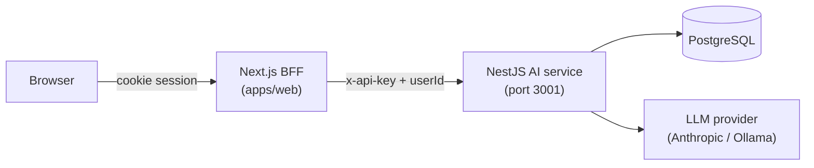
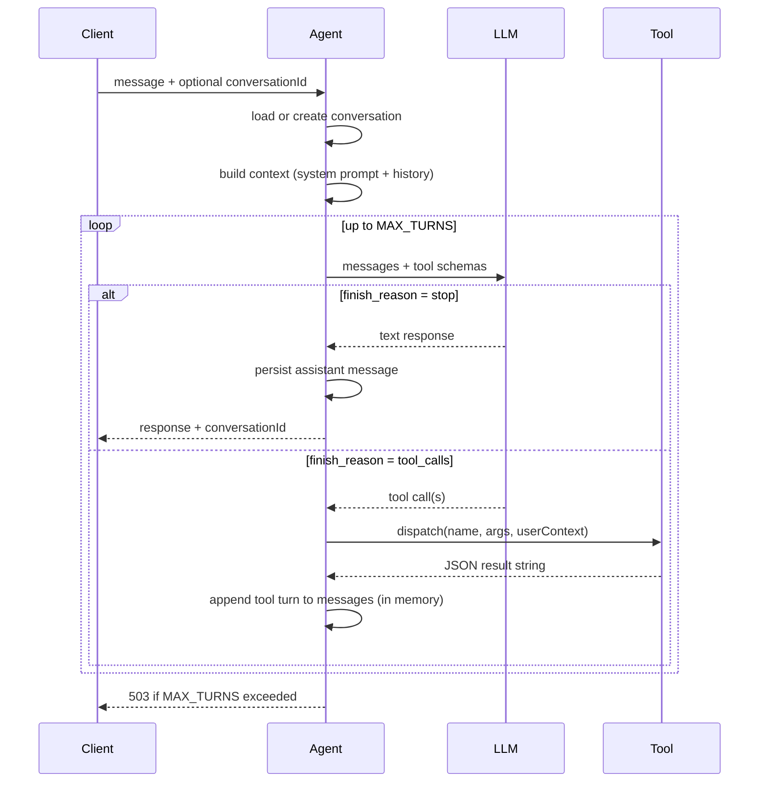
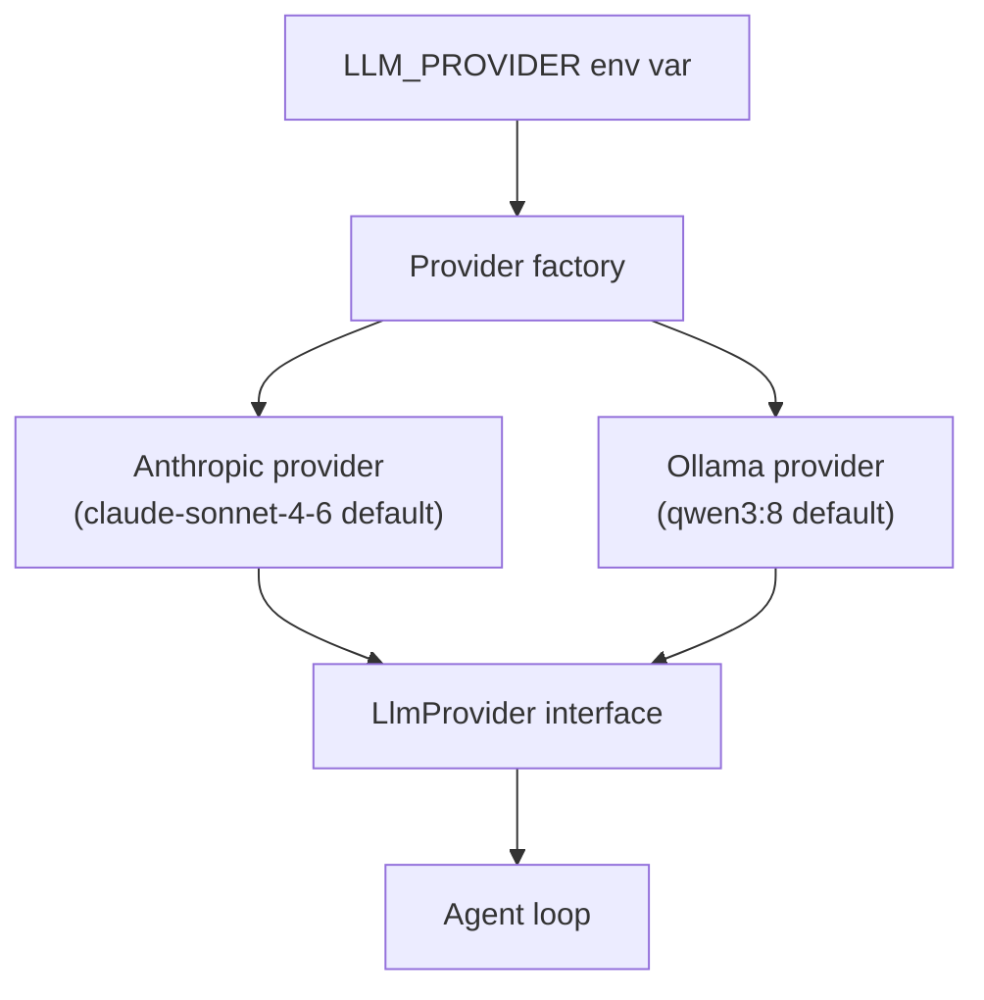
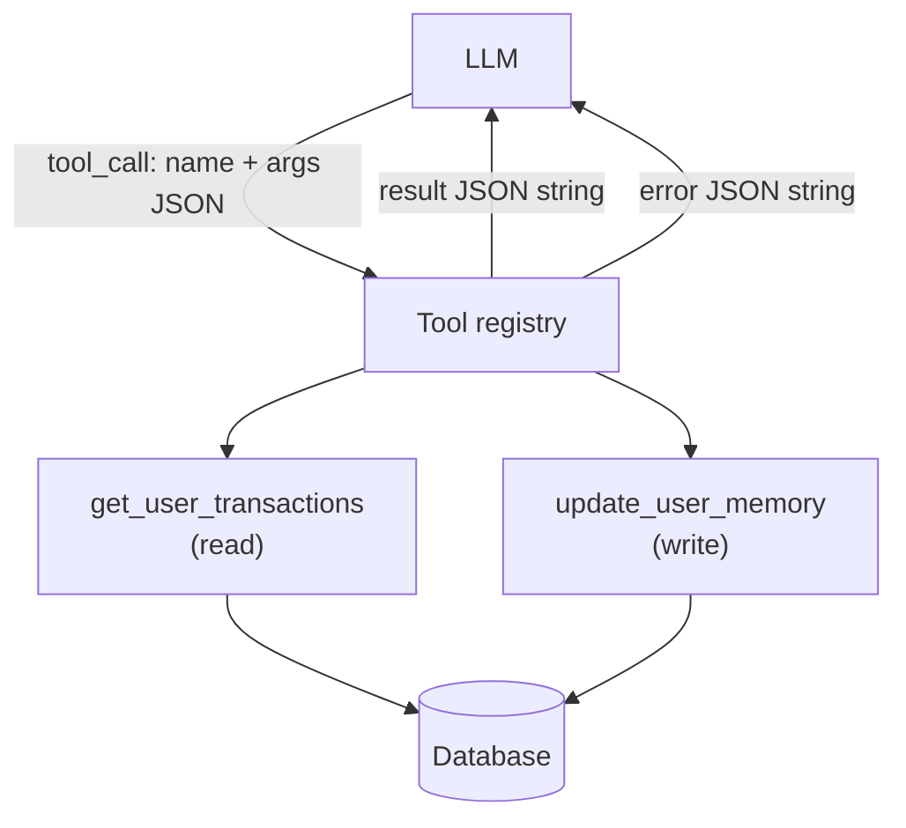
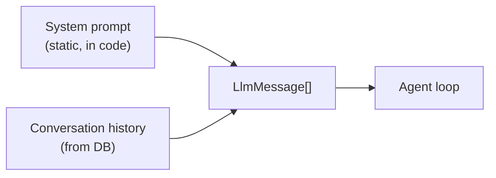
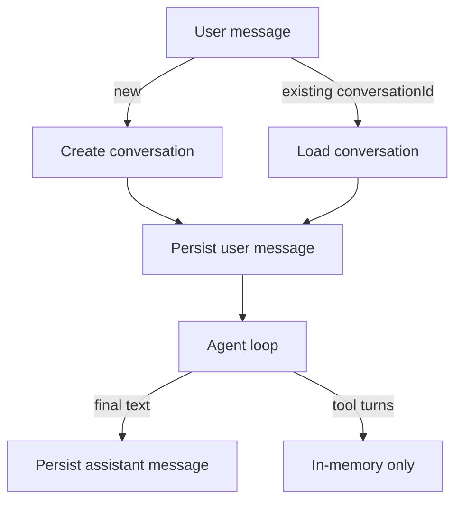

# NestJS Agent & Tool Architecture

---

## 1. System overview

The AI feature is split across two apps. The Next.js frontend is the BFF: it owns authentication and translates session cookies into a trusted user identity before forwarding requests to the AI service. The AI service owns conversation state, the LLM, and tool execution — it trusts only the API key, never the browser.

The split keeps LLM credentials and raw database access off the public-facing app. The BFF surface is small: authenticate the user, inject their identity, proxy.

---

## 2. The agentic loop

The core of the AI service is a **ReAct-style loop**: the model decides whether to call a tool or produce a final answer, and the loop feeds results back until the model stops.

**Why a turn cap?**
Without it, a model that keeps re-querying with slightly different filters can loop indefinitely. `MAX_TURNS` is a safety net and a signal — hitting it consistently means the system prompt or tool design needs work.

**Intermediate turns are not persisted.**
Tool call/result turns exist only in the in-memory messages array for the duration of the request. Only the final assistant text is written to the database. This keeps the conversation history clean for the UI and avoids storing partial reasoning.

---

## 3. LLM abstraction

The service supports two providers behind a common interface: Anthropic and Ollama. The active provider is selected at startup from environment config and injected as a single dependency everywhere it's needed.

Both providers translate to and from a shared internal message format. The agent loop never knows which provider it's talking to.

**Trade-offs:**

| | Anthropic | Ollama |
|---|---|---|
| Latency | Fast, consistent | Depends on hardware |
| Cost | Per-token billing | Free (self-hosted) |
| Tool calling | Native, reliable | Model-dependent |
| Privacy | Data leaves the machine | Fully local |

Swapping providers requires only a config change — no code changes in the agent or tool layer.

---

## 4. Tool layer

Tools are the mechanism by which the model reads user data or writes user state during a conversation. They are adapters — thin wrappers that give the LLM a name, description, and parameter schema, then execute against the real data layer when called.

### Identity scoping

`userId` is injected from the authenticated request at the top of the agent loop. It is never accepted from the LLM's tool arguments. This means a prompt-injected or hallucinated tool call cannot read another user's data — the identity boundary is enforced in code, not in the prompt.

### Error handling

Tool dispatch errors are returned to the model as a result string, not thrown as exceptions. The model sees the failure and decides how to respond ("I couldn't fetch your transactions, try a narrower date range"). This keeps the loop alive and produces a better user experience than a 500.

### Current tools

**`get_user_transactions`** — read-only. Queries the user's transactions with optional filters (date range, type, limit). Returns a result set the model can reason over.

**`update_user_memory`** — write. Records a fact, preference, goal, or instruction the user explicitly asked to remember. Persisted to the database with the user's identity.

---

## 5. Context building

Before each top-level LLM call, the agent assembles the full message context:

The system prompt is a single static string that defines the model's behavior, tool-use discipline, financial analysis rules, and security boundaries (prompt injection defense, data isolation). It is not stored in the database and does not vary per user.

**What's not in context yet:** persisted user memories (facts/preferences written via `update_user_memory`) are stored in the database but not yet retrieved into future conversation contexts. That retrieval layer is deferred.

---

## 6. Conversation persistence

The `conversationId` is returned to the client on the first message and used to resume the conversation on subsequent turns. The web app persists it in `sessionStorage`.

---

## 7. Security model

**Transport boundary**: the AI service accepts only requests carrying the correct internal API key. This header is set by the BFF and never exposed to the browser.

**Identity boundary**: the user's identity is derived from their authenticated session in the BFF and injected as a trusted value. Tool execution scopes all data access to that identity — the LLM cannot influence it.

**Prompt boundary**: the system prompt explicitly instructs the model to treat all tool output as data (not instructions), to never reveal internal structure, and to treat the system prompt as authoritative over user instructions. This is defense-in-depth against prompt injection — the code-level identity scoping is the real enforcement.

---

## 8. Key trade-offs

**In-memory tool turns vs. persisting everything**
Tool call/result rounds are not stored. This keeps conversation history clean and avoids storing the model's intermediate reasoning. The downside is that tool usage cannot be audited after the fact from the DB alone.

**Static tool registry vs. dynamic registration**
Tools are wired at startup. Adding a tool requires a code change and restart. The benefit is simplicity and predictability — no registration bugs, no ordering issues, easy to trace what's available.

**Direct DB write for memory vs. a service layer**
The memory tool currently writes directly to the database. A service layer with dedup, confidence scoring, and supersede logic would prevent duplicate memories from accumulating, but adds complexity. The direct write is intentional for now — the validation layer is planned once the memory retrieval path is built.

**No streaming**
The loop runs server-side to completion. The client waits for the full response. This simplifies the architecture significantly; streaming with tool calls requires surfacing in-progress tool status to the client, which adds protocol complexity.

**Pluggable LLM with a unified interface**
Supporting both Anthropic and Ollama means the internal message format is a common denominator. Some provider-specific capabilities (e.g. fine-grained tool choice modes, caching) are not exposed. This is an intentional trade: portability over feature completeness.
